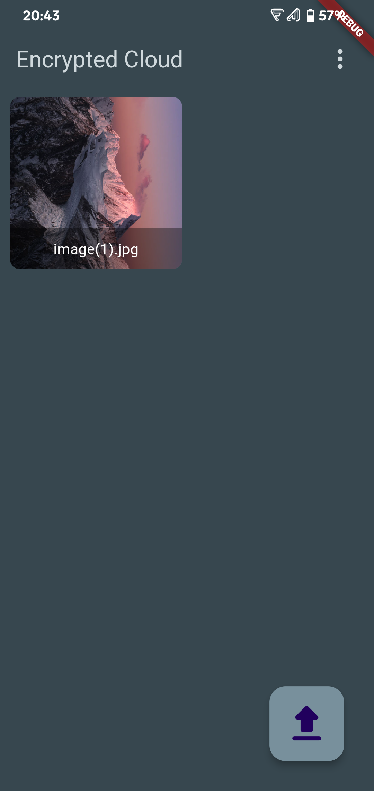

# Encrypted Cloud
An abandoned passion project, Encrypted Cloud is an Android application that encrypts files locally using AES-256 and stores the encrypted files remotely on Google Drive.

## Screenshots

